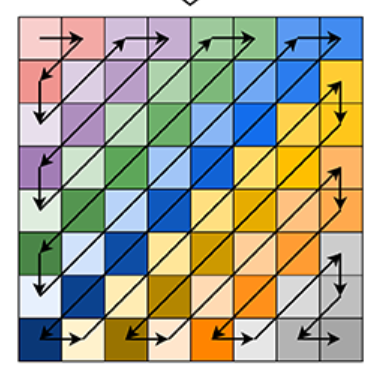
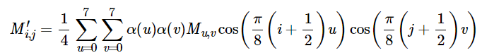

# JPEG解码

---

整个题目的步骤依照题意进行即可。

#### Step1

首先要将压缩后的矩阵读入$8\times 8$矩阵M，顺序如图所示。

基本的思路是通过观察移动路径上不同移动方向的`index`的特征，从而来判断下一个坐标的值。这样的处理方法不需要过多的思考，比较节省时间。

总结出的规律为：

* 向右移动：`(i==0 or i==7)&&(j%2==0)`
* 向下移动：`(j==0 or j==7)&&(i%2==1)`
* 向左下移动：`(i+j)%2==1`
* 向右上移动：`(i+j)%2==0`

其中如果存在同时满足多个条件的点，条件的优先级顺序从上到下

此外要注意当填充的数据不够时要填充0.

#### Step2

在得到M矩阵以后只要对其进行离散余弦逆变换就可以得到$M'$矩阵，按照题给公式即可。

其中为了方便将$\alpha$函数编写成了一个额外的函数可以直接调用。

#### Step3

接下来是将逆变换以后的矩阵进行一步解码。

而在C语言中，关于四舍五入有一个简单的公式，可以不需要用到库函数。

`(int)(x+0.5)`

这样会使得直接保留到整数，如果我们希望按小数位数保留，那么可以将`x`乘以对应位数，转化以后再除以对应值（例如三位小数对应1000.0）

---

最后可以得到满分
